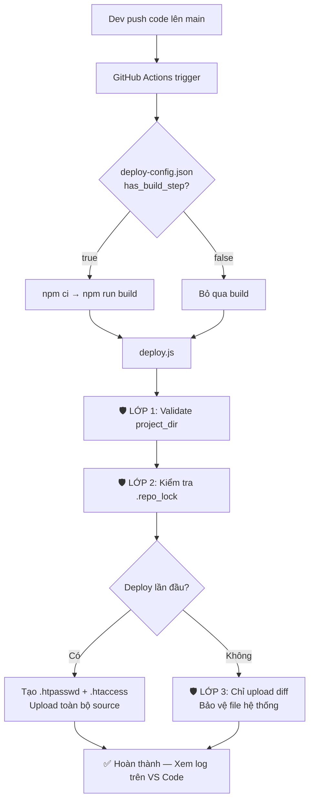

# Kế Hoạch CI/CD Deploy Tự Động Qua FTP — Hoàn Chỉnh & Chi Tiết

## Bối cảnh

Dự án `template_jline_html` là hệ thống build tĩnh: `src/` (EJS, SCSS, JS) → `npm run build` → `public/` (HTML, CSS, JS đã biên dịch). Thư mục `public/` hiện đang bị [.gitignore](file:///d:/DATA/hiep_learning/template_jline_html/.gitignore) nên **cần build trước khi deploy**.

Tài liệu hướng dẫn gốc của user sử dụng `basic-ftp` + Node.js script tùy chỉnh với 3 lớp bảo vệ. Kế hoạch này sẽ **mở rộng** tài liệu gốc để:
1. Tương thích với cả source **cần build** và **không cần build**
2. Giảm thiểu rủi ro tối đa
3. Phù hợp cấu trúc dự án hiện tại

---

## User Review Required

> [!IMPORTANT]
> **Cần xác nhận thông tin FTP Server**: Bạn cần tạo GitHub Secret `SERVER_A_CONFIG` (hoặc tên khác) chứa JSON cấu hình FTP thật. Tôi sẽ tạo [deploy-config.json](file:///d:/DATA/hiep_learning/template_jline_html/deploy-config.json) mẫu với `server: "SERVER_A"` — bạn đổi tên server nếu khác.

> [!WARNING]
> **Thư mục `public/` đang bị .gitignore**: Deploy script chạy trên GitHub Actions, nên cần **build lại** trên CI trước khi upload. Tôi đã thêm bước `npm ci` + `npm run build` vào workflow.

> [!CAUTION]
> **Không commit `public/`**: Workflow sẽ build trên CI nên không cần bỏ `public/` khỏi [.gitignore](file:///d:/DATA/hiep_learning/template_jline_html/.gitignore). Giữ nguyên [.gitignore](file:///d:/DATA/hiep_learning/template_jline_html/.gitignore) hiện tại.

---

## Tổng Quan Kiến Trúc



---

## Proposed Changes

### Component 1: Deploy Config

#### [NEW] [deploy-config.json](file:///d:/DATA/hiep_learning/template_jline_html/deploy-config.json)

File cấu hình duy nhất mà dev cần tạo:

```json
{
  "server": "SERVER_A",
  "project_dir": "template_jline_html",
  "source_folder": "public",
  "has_build_step": true,
  "build_command": "npm run build",
  "basic_auth": {
    "username": "tester",
    "password": "mat_khau_test_123"
  }
}
```

**Trường mới so với tài liệu gốc:**
| Trường | Mục đích |
|--------|----------|
| `has_build_step` | `true` = chạy build trước deploy, `false` = upload trực tiếp |
| `build_command` | Lệnh build tùy chỉnh (mặc định `npm run build`) |

---

### Component 2: GitHub Actions Workflow

#### [NEW] [deploy.yml](file:///d:/DATA/hiep_learning/template_jline_html/.github/workflows/deploy.yml)

Workflow chính, cải tiến từ tài liệu gốc:

**Cải tiến so với tài liệu gốc:**

1. **Hỗ trợ build**: Đọc `has_build_step` từ config, tự động chạy `npm ci` + build nếu cần
2. **Cache `node_modules`**: Dùng `actions/cache` cho `npm ci`, tăng tốc CI
3. **Retry FTP**: Thêm retry logic khi FTP timeout
4. **Theo dõi trực tiếp**: Dùng VS Code/Antigravity extension thay vì Chatwork

```yaml
name: Deploy To FTP Server

on:
  push:
    branches:
      - main
  workflow_dispatch:  # Cho phép chạy thủ công từ GitHub UI

concurrency:
  group: deploy-${{ github.repository }}
  cancel-in-progress: false

jobs:
  build-and-deploy:
    runs-on: ubuntu-latest
    steps:
      - name: 📥 Kéo Source Code
        uses: actions/checkout@v4
        with:
          fetch-depth: 0

      - name: 🔍 Đọc cấu hình Deploy
        id: config
        run: |
          SERVER_NAME=$(jq -r '.server' deploy-config.json | tr 'a-z' 'A-Z')
          HAS_BUILD=$(jq -r '.has_build_step // false' deploy-config.json)
          BUILD_CMD=$(jq -r '.build_command // "npm run build"' deploy-config.json)
          echo "SERVER_NAME=$SERVER_NAME" >> $GITHUB_ENV
          echo "HAS_BUILD=$HAS_BUILD" >> $GITHUB_ENV
          echo "BUILD_CMD=$BUILD_CMD" >> $GITHUB_ENV

      - name: ⚙️ Cài đặt Node.js
        uses: actions/setup-node@v4
        with:
          node-version: '20'

      - name: 📦 Cài đặt dependencies dự án (nếu cần build)
        if: env.HAS_BUILD == 'true'
        run: npm ci

      - name: 🔨 Build dự án
        if: env.HAS_BUILD == 'true'
        run: ${{ env.BUILD_CMD }}

      - name: 📦 Cài đặt thư viện deploy
        run: npm install --no-save basic-ftp apache-crypt

      - name: 🚀 Chạy Script Deploy
        run: node .github/scripts/deploy.js
        env:
          GITHUB_REPO: ${{ github.repository }}
          SERVER_SECRET_JSON: ${{ secrets[format('{0}_CONFIG', env.SERVER_NAME)] }}
```

---

### Component 3: Theo dõi Deploy từ VS Code / Antigravity (Thay thế Chatwork)

Thay vì gửi thông báo qua ChatWork, team sẽ theo dõi trạng thái deploy **trực tiếp trong editor**:

**Cách setup cho mỗi Dev (1 lần duy nhất):**
1. Mở **VS Code** hoặc **Antigravity** → vào **Extensions** (Ctrl+Shift+X)
2. Tìm và cài extension **"GitHub Actions"** (do GitHub phát hành chính chủ)
3. Đăng nhập tài khoản GitHub vào extension

**Trải nghiệm sau khi setup:**
- Sau `git push`, bấm sang tab **GitHub Actions** ở thanh bên trái
- Thấy workflow đang chạy (🔄 quay vòng), ✅ xanh = thành công, ❌ đỏ = thất bại
- Click vào workflow → xem **chi tiết từng dòng log** upload FTP mà không cần mở trình duyệt

> [!TIP]
> Ưu điểm so với ChatWork: Dev thấy log **realtime**, không cần tab thứ 2, tích hợp ngay trong công cụ làm việc hàng ngày.

---

### Component 4: Deploy Script (Trái tim hệ thống)

#### [NEW] [deploy.js](file:///d:/DATA/hiep_learning/template_jline_html/.github/scripts/deploy.js)

Script Node.js cốt lõi, **nâng cấp mạnh** từ tài liệu gốc:

**Các cải tiến bảo mật & tính năng:**

| # | Cải tiến | Chi tiết |
|---|----------|----------|
| 🛡️ 1 | Path Traversal Protection | Regex `^[a-zA-Z0-9_-]+$` cho `project_dir` |
| 🛡️ 2 | Repo Lock (chống ghi đè) | File `.repo_lock` chứa `GITHUB_REPO` |
| 🛡️ 3 | Protected Files | `.repo_lock`, `.htaccess`, `.htpasswd` không bị xóa |
| 🛡️ 4 | **[MỚI] Config Validation** | Validate toàn bộ deploy-config.json trước khi chạy |
| 🛡️ 5 | **[MỚI] FTP Connection Retry** | Tự động thử lại 3 lần khi mất kết nối |
| 🛡️ 6 | **[MỚI] Dry-run logging** | Log chi tiết mọi thao tác trước khi thực hiện |
| 🆕 7 | **[MỚI] Upload toàn bộ thư mục đệ quy** | Sửa lỗi gốc: `client.uploadFrom()` không upload thư mục |
| 🆕 8 | **[MỚI] Tương thích build/non-build** | Đọc `source_folder` từ config, hoạt động với bất kỳ thư mục output |
| 🆕 9 | **[MỚI] Git diff cải tiến** | Xử lý renamed files (`R` status), file paths có khoảng trắng |

**Các lỗi trong tài liệu gốc đã sửa:**

> [!WARNING]
> 1. **`client.uploadFrom(config.source_folder, targetDir)`** — Hàm `uploadFrom` của `basic-ftp` chỉ upload **1 file**, KHÔNG upload thư mục. Script gốc sẽ crash ở bước deploy lần đầu. → **Đã sửa**: Dùng `uploadFromDir()` hoặc upload đệ quy từng file.
> 2. **`git diff HEAD^ HEAD`** — Sẽ fail nếu chỉ có 1 commit (lần đầu push). → **Đã sửa**: Kiểm tra số lượng commit trước.
> 3. **`await client.cd('/')`** — Sau khi cd vào targetDir, cd về root `/` có thể không đúng nếu FTP root khác `/`. → **Đã sửa**: Lưu FTP root path ban đầu.
> 4. **Không kiểm tra `source_folder` tồn tại** — Nếu chưa build, thư mục `public/` không tồn tại → crash. → **Đã sửa**: Validate trước khi deploy.

---

### Component 5: Cập nhật .gitignore

#### [MODIFY] [.gitignore](file:///d:/DATA/hiep_learning/template_jline_html/.gitignore)

Thêm dòng để không commit file tạm của deploy:

```diff
 /node_modules
 /public
+# Deploy artifacts (generated on CI)
+.repo_lock
+.htpasswd
+.htaccess
```

---

## Giai Đoạn Setup GitHub Organization Secrets (Thủ công - Leader làm)

> [!IMPORTANT]
> Phần này bạn làm **thủ công** trên GitHub, chỉ cần làm **1 lần** cho toàn bộ Organization.

### Bước 1: Tạo Organization Secret cấu hình Server

Vào **Organization → Settings → Secrets and variables → Actions → Tab Secrets → New organization secret**

| Secret Name | Value (JSON) | Access |
|-------------|-------------|--------|
| `SERVER_A_CONFIG` | `{"host":"ftp.domain.com","user":"ftp_user","pass":"ftp_pass","ftp_dir":"./public_html/client","root_path":"/var/www/vhosts/domain.com/public_html/client"}` | All repositories |

> [!TIP]
> Thêm server mới sau này chỉ cần tạo thêm 1 secret với tên `SERVER_B_CONFIG`, `SERVER_C_CONFIG`,... Tất cả repo trong org đều tự động dùng được.

---

## Verification Plan

### Automated Tests

> [!NOTE]
> Do hệ thống deploy phụ thuộc vào GitHub Actions + FTP Server, không thể test tự động hoàn toàn tại local. Thay vào đó dùng **kiểm tra cú pháp** + **test thủ công**.

**1. Validate JSON syntax:**
```bash
cd d:\DATA\hiep_learning\template_jline_html
node -e "JSON.parse(require('fs').readFileSync('deploy-config.json','utf8')); console.log('✅ deploy-config.json OK')"
```

**2. Validate deploy.js syntax:**
```bash
node --check .github/scripts/deploy.js
```

**3. Validate deploy.yml syntax (nếu có `actionlint`):**
```bash
# Kiểm tra YAML hợp lệ
node -e "const y=require('fs').readFileSync('.github/workflows/deploy.yml','utf8'); console.log('✅ YAML readable, lines:', y.split('\n').length)"
```

### Manual Verification (Bạn kiểm tra)

1. **Push lên `main`** → vào **repo GitHub → tab Actions** → xem workflow chạy
2. **Kiểm tra từng step** trong log:
   - ✅ `Đọc cấu hình Deploy` — hiện đúng SERVER_NAME
   - ✅ `Build dự án` — chạy nếu `has_build_step: true`
   - ✅ `Chạy Script Deploy` — upload thành công, không lỗi
3. **FTP vào server** kiểm tra thư mục `{ftp_dir}/template_jline_html/`:
   - Có `.repo_lock` chứa đúng tên repo
   - Có `.htaccess` + `.htpasswd`
   - Có toàn bộ file từ `public/`
4. **Mở browser** → truy cập URL → phải hiện yêu cầu đăng nhập Basic Auth
5. **Test cập nhật**: Sửa 1 file trong `src/`, push → chỉ file đó được upload (kiểm tra log)
